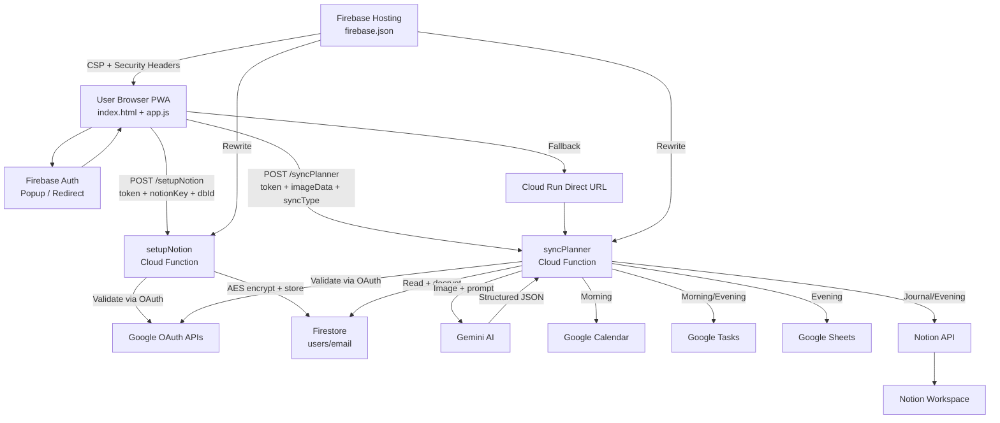

# Project Change Log and Current Architecture

## Scope
This document summarizes the full evolution of the AI Planner project from initial commit through the current deployed state, including the latest CSP hardening and encryption implementations.

## Change Timeline

### 1. `d1ae171` — Security Cleanup
- Removed exposed credential artifacts and tightened `.gitignore`.

### 2. `1db6faa` — UX/Theme Improvements
- Added dynamic theming (Light / Dark / OLED / Auto).
- Added license and documentation.

### 3. `22627da` — Reliability & Security Guards
- Added image size limits on client (20MB) and server.
- Improved error handling and cleanup.

### 4. `8f388e8` — Architecture & Security Hardening
- Added `/setupNotion` endpoint for secure key submission.
- Implemented AES-256-CBC encryption for Notion keys.
- Hardened CORS (origin allowlist), request validation, and Firestore write policy (client read-only).
- Added security headers to `firebase.json`.

### 5. Latest — CSP Migration & Auth Improvements
- **Extracted** all inline CSS → `public/styles.css`, inline JS → `public/app.js`.
- **Replaced** Tailwind CDN runtime with prebuilt `public/tailwind.css` (via `npx tailwindcss`).
- **Enforced** strict Content Security Policy with SHA-256 hash for remaining inline script.
- **Added** `signInWithRedirect` fallback for popup-blocked browsers (Brave, Safari).
- **Added** mobile detection: redirect-first auth for phones/tablets.
- **Updated** service worker cache to v2 with new external files.

---

## Before vs Now

### 1) Notion Key Lifecycle
| Before | Now |
|--------|-----|
| Keys passed from frontend in sync payload | Dedicated `/setupNotion` encrypts keys server-side |
| Plaintext storage model | AES-256-CBC encryption with key in Secret Manager |
| Client manages keys | Server-only read/decrypt during sync |

### 2) API Boundary
| Before | Now |
|--------|-----|
| Broad CORS | Origin allowlist |
| Weak payload validation | Strict content-type, sync type, and data URL checks |

### 3) Firestore Trust Model
| Before | Now |
|--------|-----|
| Client read + write own doc | Client read-only; writes via Admin SDK only |

### 4) Frontend Architecture
| Before | Now |
|--------|-----|
| 944-line monolithic `index.html` | ~250-line HTML + `app.js` + `styles.css` + `tailwind.css` |
| Tailwind CDN (runtime compiler) | Prebuilt static CSS (faster, smaller) |
| Token in `sessionStorage` | Token in memory only |
| Popup-only auth | Popup + redirect fallback; redirect-first on mobile |

### 5) Security Headers
| Before | Now |
|--------|-----|
| Basic headers | Full CSP + `X-Frame-Options` + `Referrer-Policy` + `Permissions-Policy` |
| No CSP | Strict CSP with SHA-256 hash, `upgrade-insecure-requests` |

---

## Current System Architecture



## Current File Structure
```
AI PLANNER/
├── public/
│   ├── index.html          # HTML structure only
│   ├── app.js              # Application logic (ES module)
│   ├── styles.css           # Custom CSS (themes, glass, animations)
│   ├── tailwind.css         # Prebuilt Tailwind utilities
│   ├── sw.js               # Service Worker (v2)
│   ├── manifest.json        # PWA config
│   ├── privacy.html         # Privacy policy
│   ├── planner.html         # Planner PDF viewer
│   └── gear.html            # Gear recommendations
├── functions/
│   ├── index.js             # Cloud Functions (setupNotion, syncPlanner)
│   └── package.json         # Dependencies
├── firebase.json            # Hosting config + CSP headers + rewrites
├── firestore.rules          # Read-only client access
├── tailwind.config.js       # Tailwind build config
├── src/input.css            # Tailwind directives
├── DESIGN_AND_DECISIONS.md  # Architecture & design docs
├── SECURITY_CSP_PLAN.md     # CSP migration plan (✅ complete)
├── PROJECT_CHANGELOG_AND_CURRENT_ARCHITECTURE.md  # This file
└── README.md                # Project overview
```

## Notes
- Runtime: Node 20 (`functions/package.json`).
- `GEMINI_API_KEY`: loaded via `defineString` (from `.env` file).
- `NOTION_ENCRYPTION_KEY`: managed via Google Cloud Secret Manager.
- CSP is fully enforced and active in production.
