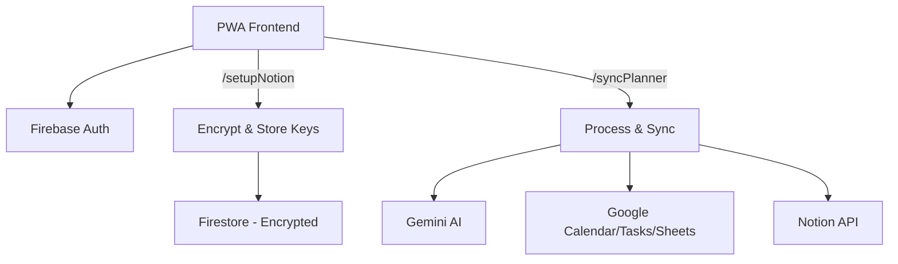

# AI Planner — Zero Storage Architecture 🌿

**A privacy-focused PWA that digitizes handwritten planner pages using Google Gemini AI.**

[](https://youtu.be/8NFqb9xvnIU?si=7pPnuoKzNEHtZS_m)
[](https://planner.analogdigital.tech/)

👉 **Try out yourself:** [https://planner.analogdigital.tech/](https://planner.analogdigital.tech/)


[](https://github.com/shoubhiksaha/AI-PLANNER/actions/workflows/main.yml)


---

## 📖 The "Zero Storage" Philosophy

Unlike traditional apps that store user images in an S3 bucket or database, **AI Planner** operates on a strict **Zero Storage** architecture.

- User images are processed **in-memory** (transient RAM only).
- Data is extracted by Gemini AI and synced to Google Calendar, Tasks, Sheets, and Notion.
- The original image buffer is wiped immediately after processing.
- Notion integration keys are **encrypted at rest** (AES-256-GCM) with keys managed via Google Cloud Secret Manager.

**Result**: Verifiable privacy. We cannot see your journal even if we wanted to.

---

## 🛡️ Security Highlights

| Layer | Implementation |
|-------|---------------|
| **Encryption** | AES-256-GCM for Notion keys (legacy keys migrated automatically); encryption key in Secret Manager |
| **CSP** | Strict Content Security Policy with SHA-256 script hashes |
| **Auth** | Firebase Auth with popup + redirect fallback; redirect-first on mobile |
| **Firestore** | Client read-only; all writes via Admin SDK |
| **Tokens** | OAuth tokens in-memory only (not persisted in browser storage) |
| **Headers** | `X-Frame-Options: DENY`, `upgrade-insecure-requests`, `Permissions-Policy` |
| **API** | Origin allowlist, strict payload validation, 20MB image limit |

---

## 🏗️ Architecture



**Stack**:
| Component | Technology |
|-----------|-----------|
| Frontend | Vanilla JS + Prebuilt Tailwind CSS (PWA) |
| Backend | Firebase Functions Gen 2 (Node.js 20) |
| AI | Google Gemini (Flash model cascade) |
| Auth | Google Identity Services (OAuth 2.0) |
| Security | CSP + AES-256-GCM Encryption + Secret Manager |

---

## 📊 Production SLOs (Service Level Objectives)

| Metric | Target | Description |
|--------|--------|-------------|
| **Success Rate (Availability)** | **99.9%** | API sync functions should return 200 OK or 4xx for expected application drops. |
| **Latency (p95)** | **< 30s** | 95% of Gemini extraction and Notion upload chains should complete under 30 seconds. |
| **Error Budget** | **0.1% / month** | Allowable 5xx failures per month trigger Slack/Email alerts via GCP Logging before causing outages. |

---

## ✅ Engineering Quality Gates

Use these gates before any production merge:

- `npm run check:conflicts` - blocks unresolved merge markers
- `npm run test:frontend` - UI/helper/service worker regression tests
- `npm run test:backend` - functions unit/integration tests
- `npm run test:rules` - Firestore rules emulator tests
- `npm run test:e2e:smoke` - Playwright smoke path

Production deploy on `main` is CI-gated by the workflow in `.github/workflows/main.yml`.

---

## 📈 Project Evolution

### V1: The MVP
- Basic image upload → Google Calendar events.
- Simple Firebase Trigger.

### V2: Feature Expansion
- Added Evening Sync (task completion), Expenses, Health, and Journaling.
- Task completion logic refined from fuzzy to exact matching.

### V3: Zero Storage
- **Zero Storage**: RAM-only image processing.
- **Model Cascade**: Gemini 2.5 Flash-Lite → 2.5 Flash → 2.0 Flash-Lite.
- **Notion Upload**: Custom Direct File Upload Protocol.

### V4: CSP & Restructuring
- **CSP**: Full Content Security Policy — all inline JS/CSS extracted to external files.
- **Auth Hardening**: Mobile redirect-first + popup-blocker fallback.
- **Code Separation**: Monolithic HTML split into `app.js`, `styles.css`, `tailwind.css`.
- **Firestore Lockdown**: Client read-only; all writes via Admin SDK.

### V5: Security Hardening
- **Rate Limiting**: Firestore-backed 10 req/min for Sync, 20 req/min for auth endpoints.
- **Payload Validation**: Strict 100MB JSON limit + base64 decoded byte size checks to prevent OOM.
- **Key Rotation**: Dual-key AES-256-GCM encryption strategy for Notion Keys with zero-downtime migration.

### V6: Domain Migration & UI Polish
- **CORS Resolution**: Updated backend origin allowlist to fully support `planner.analogdigital.tech`.
- **Data Sync Reliability**: Fixed an issue in `syncGoogleTasks` where invalid dates crashed task insertion.
- **Notion Integration UX**: Added explicit user-friendly error messages for Notion key decryption failures.

### V7: Engineering Stability & Architecture Consolidation
- **Massive Test Expansion**: Rewrote and expanded backend tests (`UniversalAIAdapter`, `googleSync`, `rateLimit`) to achieve >95% statement coverage across core services (261 passing backend tests).
- **Documentation Consolidation**: Merged 10+ fragmented project architecture, audit, and roadmap documents into a single-source-of-truth `WIKI.md`.
- **Zero-Warning Codebase**: Completely resolved all ESLint warnings via strict dead-code elimination.
- **GDPR & Gamification**: Implemented monthly credit renewal, gamification streak milestones, cascading account deletion, and GDPR-compliant data export limits.

### V8: Google Verification Readiness
- Fully aligned the project with Google OAuth application requirements.
- Updated privacy policies to explicitly cite Google Calendar, Tasks, Drive, and Sheets scopes.
- Added comprehensive reviewer instructions and tightened OAuth scope requesting to adhere strictly to least-privilege principles.

### V9: Bring Your Own Key (BYOK) & Cloud KMS (Current)
- **BYOK Pipeline**: Implemented full support for users bringing custom AI API Keys, allowing customized execution without depending solely on standard infrastructure limits.
- **Cloud KMS Integration**: Deployed Google Cloud Key Management Service (KMS) to generate enveloped Data Encryption Keys (DEK) for vaulting BYOK credentials securely.
- **CI/CD Hardening**: Updated the GitHub Actions pipeline to seamlessly inject the required `KMS_KEY_NAME` environment variables into the non-interactive Firebase deployment routine.

### V10: Future Roadmap
- **Human-in-the-Loop Review**: Review of extracted files by user with confidence scores and templating (inspired by DocSync AI).
- **Google Drive Image Fallback**: Store processed images in Google Drive if Notion is not configured.
- **Agentic AI Pivot**: Transitioning from a static parser to a proactive agent (Clarification Loops, Smart Task Rollover).
- **Multi-Provider Fallback**: Support for OpenAI, Anthropic, DeepSeek as fallback models.
- **CSP Reporting**: Add CSP enforcement violation monitoring endpoint.

---

## 🛠️ Technical Case Studies

### 1. Transient Memory Processing
**Problem**: Standard Firebase SDKs assume file upload to Storage Bucket.
**Solution**: `Buffer.from(base64)` for in-memory processing. Removed `admin.storage()` dependency entirely.

### 2. Notion File Upload Protocol
**Problem**: Upload images to Notion without hosting them ourselves.
**Solution**: Three-step protocol: Init upload → PUT binary with explicit `Authorization` → Link `file_id` to page.

### 3. Static Noise Bug
**Problem**: Images in Notion appeared as corrupted static.
**Root Cause**: Data URI header (`data:image/jpeg;base64,...`) corrupting binary JPEG magic bytes.
**Solution**: Strip header before buffer creation:
```javascript
const base64Data = imageData.split(',')[1];
const buffer = Buffer.from(base64Data, 'base64');
```

### 4. CSP Migration
**Problem**: 944-line monolithic HTML with inline JS/CSS blocked CSP enforcement.
**Solution**: Extracted to external files, replaced Tailwind CDN with prebuilt CSS, added SHA-256 hash for remaining inline script.

---

## 📁 Project Structure

```
public/
├── index.html       # HTML markup only
├── app.js           # Application logic (ES module)
├── styles.css       # Custom CSS (themes, glass, animations)
├── tailwind.css     # Prebuilt Tailwind utilities
└── sw.js            # Service Worker v2

functions/
├── index.js         # Cloud Functions (setupNotion, syncPlanner)
└── package.json     # Dependencies

Config:
├── firebase.json           # Hosting + CSP headers + rewrites
├── firestore.rules          # Client read-only rules
├── tailwind.config.js       # Build config
└── src/input.css            # Tailwind directives
```

---

## 📚 Documentation

| Document | Purpose |
|----------|---------|  
| [WIKI.md](WIKI.md) | **Single source of truth** — architecture, full changelog, security, testing, roadmap, compliance, interview & resume guide, learning plan |
| [docs/oauth-verification/](docs/oauth-verification/) | Google OAuth submission artefacts — scope justifications, submission checklist, reviewer demo script |
| [public/privacy.html](public/privacy.html) | Public-facing Privacy Policy |

---

## 🚀 How to Run

1. **Clone**:
    ```bash
    git clone https://github.com/shoubhiksaha/AI-PLANNER.git
    ```
2. **Install**:
    ```bash
    cd functions && npm install
    cd .. && npm install
    ```
3. **Build Tailwind** (after HTML changes):
    ```bash
    npx tailwindcss -i src/input.css -o public/tailwind.css --minify
    ```
4. **Run Tests**:
    ```bash
    npm run check:conflicts  # Merge-conflict guard
    npm run test:backend     # Backend tests with coverage
    npm run test:frontend    # Frontend tests (jsdom)
    npm run test:e2e:smoke   # Playwright smoke (CI mode)
    npm test                 # Full test flow (requires Java + Auth Emulator)
    ```
5. **Local Verification Prerequisites**:
    - **Java 21+**: Required to run `firebase emulators:exec` for `test:rules`.
    - **Auth Emulator**: `npm run test:e2e` spins up Playwright against a locally-running Auth emulator at `127.0.0.1:9099`.
    - **Playwright browsers**: `npx playwright install chromium`
5. **Run Firestore Rules Tests** (requires Java 21+):
    ```bash
    # Install Java 21 (Temurin) if not present
    # macOS: brew install --cask temurin21
    # Ubuntu: apt install temurin-21-jdk

    npm install -g firebase-tools
    cd functions && firebase emulators:exec \
      --project ai-planner-project-467800 \
      --only firestore \
      "npx jest __tests__/firestore.rules.test.js --verbose"
    ```
6. **Deploy**:
    ```bash
    firebase deploy
    ```
