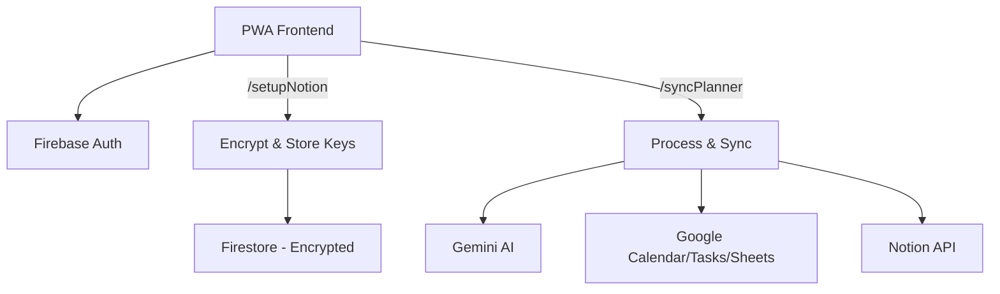

# AI Planner — Zero Storage Architecture 🌿

**A privacy-focused PWA that digitizes handwritten planner pages using Google Gemini 2.0 Flash.**

[](https://youtu.be/8NFqb9xvnIU?si=7pPnuoKzNEHtZS_m)
[](https://ai-planner-project-467800.web.app)

> [!NOTE]
> **Testing Mode**: New users need to be whitelisted. Email [officialshoubhiksaha@gmail.com](mailto:officialshoubhiksaha@gmail.com) with subject "Beta Access".


---

## 📖 The "Zero Storage" Philosophy

Unlike traditional apps that store user images in an S3 bucket or database, **AI Planner** operates on a strict **Zero Storage** architecture.

- User images are processed **in-memory** (transient RAM only).
- Data is extracted by Gemini AI and synced to Google Calendar, Tasks, Sheets, and Notion.
- The original image buffer is wiped immediately after processing.
- Notion integration keys are **encrypted at rest** (AES-256-CBC) with keys managed via Google Cloud Secret Manager.

**Result**: Verifiable privacy. We cannot see your journal even if we wanted to.

---

## 🛡️ Security Highlights

| Layer | Implementation |
|-------|---------------|
| **Encryption** | AES-256-CBC for Notion keys; encryption key in Secret Manager |
| **CSP** | Strict Content Security Policy with SHA-256 script hashes |
| **Auth** | Firebase Auth with popup + redirect fallback; redirect-first on mobile |
| **Firestore** | Client read-only; all writes via Admin SDK |
| **Tokens** | OAuth tokens in-memory only (not persisted in browser storage) |
| **Headers** | `X-Frame-Options: DENY`, `upgrade-insecure-requests`, `Permissions-Policy` |
| **API** | Origin allowlist, strict payload validation, 20MB image limit |

---

## 🏗️ Architecture



**Stack**:
| Component | Technology |
|-----------|-----------|
| Frontend | Vanilla JS + Prebuilt Tailwind CSS (PWA) |
| Backend | Firebase Functions Gen 2 (Node.js 20) |
| AI | Google Gemini (Flash model cascade) |
| Auth | Google Identity Services (OAuth 2.0) |
| Security | CSP + AES-256-CBC Encryption + Secret Manager |

---

## 📈 Project Evolution

### V1: The MVP
- Basic image upload → Google Calendar events.
- Simple Firebase Trigger.

### V2: Feature Expansion
- Added Evening Sync (task completion), Expenses, Health, and Journaling.
- Task completion logic refined from fuzzy to exact matching.

### V3: Zero Storage
- **Zero Storage**: RAM-only image processing.
- **Model Cascade**: Gemini 2.5 Flash-Lite → 2.5 Flash → 2.0 Flash-Lite.
- **Notion Upload**: Custom Direct File Upload Protocol.

### V4: Security Hardening & CSP (Current)
- **Encryption**: AES-256-CBC for Notion integration keys with Secret Manager.
- **CSP**: Full Content Security Policy — all inline JS/CSS extracted to external files.
- **Auth Hardening**: Mobile redirect-first + popup-blocker fallback.
- **Code Separation**: Monolithic HTML split into `app.js`, `styles.css`, `tailwind.css`.
- **Firestore Lockdown**: Client read-only; all writes via Admin SDK.

### V5: Future Roadmap
- **BYOK**: Bring Your Own Key support.
- **Multi-Provider**: Support for OpenAI, Anthropic, DeepSeek.
- **CSP Reporting**: Add violation monitoring endpoint.
- **CI/CD**: GitHub Actions for automated test + deploy.

---

## 🛠️ Technical Case Studies

### 1. Transient Memory Processing
**Problem**: Standard Firebase SDKs assume file upload to Storage Bucket.
**Solution**: `Buffer.from(base64)` for in-memory processing. Removed `admin.storage()` dependency entirely.

### 2. Notion File Upload Protocol
**Problem**: Upload images to Notion without hosting them ourselves.
**Solution**: Three-step protocol: Init upload → PUT binary with explicit `Authorization` → Link `file_id` to page.

### 3. Static Noise Bug
**Problem**: Images in Notion appeared as corrupted static.
**Root Cause**: Data URI header (`data:image/jpeg;base64,...`) corrupting binary JPEG magic bytes.
**Solution**: Strip header before buffer creation:
```javascript
const base64Data = imageData.split(',')[1];
const buffer = Buffer.from(base64Data, 'base64');
```

### 4. CSP Migration
**Problem**: 944-line monolithic HTML with inline JS/CSS blocked CSP enforcement.
**Solution**: Extracted to external files, replaced Tailwind CDN with prebuilt CSS, added SHA-256 hash for remaining inline script.

---

## 📁 Project Structure

```
public/
├── index.html       # HTML markup only
├── app.js           # Application logic (ES module)
├── styles.css       # Custom CSS (themes, glass, animations)
├── tailwind.css     # Prebuilt Tailwind utilities
└── sw.js            # Service Worker v2

functions/
├── index.js         # Cloud Functions (setupNotion, syncPlanner)
└── package.json     # Dependencies

Config:
├── firebase.json           # Hosting + CSP headers + rewrites
├── firestore.rules          # Client read-only rules
├── tailwind.config.js       # Build config
└── src/input.css            # Tailwind directives
```

---

## 📚 Documentation

| Document | Purpose |
|----------|---------|
| [DESIGN_AND_DECISIONS.md](DESIGN_AND_DECISIONS.md) | Architecture & design philosophy |
| [SECURITY_CSP_PLAN.md](SECURITY_CSP_PLAN.md) | CSP migration plan (✅ all phases complete) |
| [PROJECT_CHANGELOG](PROJECT_CHANGELOG_AND_CURRENT_ARCHITECTURE.md) | Full change history & current architecture |
| [BREACH_RESPONSE_PLAN.md](BREACH_RESPONSE_PLAN.md) | Data breach response process |

---

## 🚀 How to Run

1. **Clone**:
    ```bash
    git clone https://github.com/shoubhiksaha/AI-PLANNER.git
    ```
2. **Install**:
    ```bash
    cd functions && npm install
    cd .. && npm install
    ```
3. **Build Tailwind** (after HTML changes):
    ```bash
    npx tailwindcss -i src/input.css -o public/tailwind.css --minify
    ```
4. **Deploy**:
    ```bash
    firebase deploy
    ```
