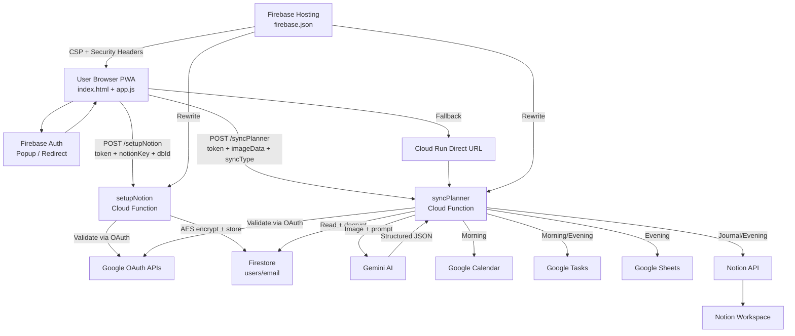

# AI Planner — Project Wiki 📚

> This is the single living document for everything about the AI Planner project — architecture, decisions, changelog, security, testing, roadmap, compliance, and career guidance. All history is preserved below.

**Table of Contents**
1. [Architecture & Design Decisions](#1-architecture--design-decisions)
2. [Full Changelog](#2-full-changelog)
3. [Security](#3-security)
4. [Testing](#4-testing)
5. [Future Roadmap](#5-future-roadmap)
6. [Google OAuth Verification](#6-google-oauth-verification)
7. [Career — Interview & Resume Guide](#7-career--interview--resume-guide)
8. [Learning Plan](#8-learning-plan)

---

## 1. Architecture & Design Decisions

### 1.1 Core Philosophy: "Zero Storage"

The project avoids storing user data (images, analyzed text, planner contents) in its own persistent database.

**Rationale:**
- **Privacy First**: Data flows *through* our server, not *into* it. We cannot access user journals even if compelled.
- **Cost Efficiency**: No cloud storage bills for user images.
- **Compliance**: Simplifies GDPR/CCPA. We are the **data controller** but minimize liability by storing almost nothing. Google and Notion are our **processors**. The only data we persist is email and encrypted Notion keys.

**Implementation:**
- Images are received via HTTP, held in memory (RAM), processed by AI, sent to external services, and immediately discarded.
- We use `firebase-functions` with 1GiB memory to handle transient heavy payloads without writing to disk.

---

### 1.2 Serverless Backend (Firebase Functions Gen 2)

All backend logic runs on Firebase Cloud Functions (Gen 2), deployed as Cloud Run services.

**Key Optimizations:**
- **Lazy Loading**: Heavy modules (`googleapis`, `@notionhq/client`) are `require()`-ed inside function scope, reducing cold start times.
- **Custom Timeout**: 300s because AI processing + multi-service syncing can be slow.
- **Manual CORS**: Custom origin allowlist with explicit `OPTIONS` handling.

**Endpoints:**
| Endpoint | Purpose | Auth |
|----------|---------|------|
| `POST /syncPlanner` | Process planner image, sync to Google + Notion | OAuth token |
| `POST /setupNotion` | Encrypt and store Notion integration keys | OAuth token |
| `POST /setupBYOK` | Store Bring Your Own Key (BYOK) config | OAuth token |
| `POST /exportUserData` | GDPR data export | OAuth token |
| `POST /deleteUserAccount` | Cascading account deletion | OAuth token |
| `POST /logClientError` | Frontend error ingestion to GCP | None |

---

### 1.3 AI Integration (Google Gemini)

**Model Strategy (cascade):**
- **Primary**: `gemini-2.5-flash-lite-preview-06-17` (fastest, cheapest)
- **Fallback 1**: `gemini-2.5-flash-preview-04-17`
- **Fallback 2**: `gemini-2.0-flash-lite` (stable, proven)

**Resilience:**
- Retry Logic: Exponential backoff (1s, 2s, 4s...) on HTTP 429 rate limits.
- Model Cascade: If primary fails, automatically tries next model.
- JSON Enforcement: `responseMimeType: "application/json"` ensures parseable output.

---

### 1.4 Performance & Parallelism

| Sync Type | Parallel Tasks |
|-----------|---------------|
| Morning | Calendar Events + Google Tasks |
| Evening | Sheets (Expenses/Health) + Notion (Brain Dump) + Task Completion |
| Journal | Notion Image Upload + AI Date Extraction |

Using `Promise.allSettled` instead of `Promise.all` allows partial success — if Notion fails, Calendar events still get created.

---

### 1.5 Daily Workflows

**Morning Sync:**
- Parse schedule and To-Dos from handwritten planner image.
- Create Calendar Events (with reminders).
- Create Google Tasks (due today).

**Evening Sync:**
- Mark tasks as completed in Google Tasks based on checkmarks.
- Parse expenses, health metrics, and brain dump text.
- Log financials to Google Sheets ("Expenses" tab).
- Log health stats to Google Sheets ("Health" tab).
- Upload planner image + brain dump to Notion.

**Journal Sync:**
- Upload high-res journal image to Notion.
- AI extracts the date for the page title.

---

### 1.6 Architectural Diagram



---

### 1.7 Gamification System

Users earn **streak rewards** for consecutive daily syncs:

| Milestone | Reward |
|-----------|--------|
| 7-Day Streak | +5 Booster Credits |
| 30-Day Streak | +20 Booster Credits + 1 Freeze |
| 90-Day Streak | +50 Booster Credits + 3 Freezes |

- `lastAwardedStreak` prevents double-paying the same milestone.
- **Streak Freezes** let users maintain a streak over a missed day.
- `subscriptionRenewalDate` (YYYY-MM format) gates monthly free credit reset:
  - Free tier: 15 credits/month
  - Standard: 100 credits/month
  - Pro: 250 credits/month

---

### 1.8 Frontend Architecture

```
public/
├── index.html          # HTML structure only (~300 lines)
├── app.js              # Application logic (ES module)
├── app-helpers.js      # Shared utilities (theme, view switch)
├── styles.css          # Custom CSS (themes, glass, animations)
├── tailwind.css        # Prebuilt Tailwind utilities
├── sw.js               # Service Worker (offline caching)
├── sw-constants.js     # Cache version constants
├── sw-register.js      # Service worker registration
├── manifest.json       # PWA manifest
├── privacy.html        # Privacy policy (public)
├── planner.html        # Planner PDF viewer
└── gear.html           # Gear recommendations
```

**Design Language:**
- Glassmorphism: frosted-glass cards with `backdrop-filter: blur()`
- Dynamic Theming: Light / Dark / OLED / Auto (system-aware via `prefers-color-scheme`)
- Theme variables used throughout (`bg-theme-card`, `text-theme-text`, `border-theme-border`) — avoids `dark:` utility duplication and ensures all modals adapt to OLED
- Tailwind CSS: prebuilt at deploy time (not runtime CDN)

**Theme-aware Approach:**
Hardcoded `dark:bg-gray-900` pairs are specifically avoided inside modals. Instead, CSS variables like `--color-card` and `--color-bg` are set per theme class on `<body>` and consumed as `bg-theme-card` etc.

---

### 1.9 External Integrations

| Service | Usage | Sync Type |
|---------|-------|-----------|
| Google Calendar | Create events with reminders | Morning |
| Google Tasks | Create/complete tasks | Morning/Evening |
| Google Sheets | Log expenses + health data | Evening |
| Google Drive | Expense spreadsheet file access | Evening |
| Notion | Two-step Direct File Upload (Init → PUT binary → Link `file_id`) | Journal/Evening |

**Notion Protocol Detail:**
Images flow: User browser → server RAM → Notion. Never persisted on our infrastructure.
The hardest bug here: images appeared as static noise in Notion. Root cause was the Data URI header (`data:image/jpeg;base64,...`) corrupting JPEG magic bytes. Fix: strip the prefix before `Buffer.from()`.

---

## 2. Full Changelog

> All commits and milestones. This is the project's living history.

### `d1ae171` — Security Cleanup
- Removed exposed credential artifacts and tightened `.gitignore`.

### `1db6faa` — UX/Theme Improvements
- Added dynamic theming (Light / Dark / OLED / Auto).
- Added license and documentation.

### `22627da` — Reliability & Security Guards
- Added image size limits on client (20MB) and server.
- Improved error handling and cleanup.

### `8f388e8` — Architecture & Security Hardening
- Added `/setupNotion` endpoint for secure key submission.
- Implemented AES-256-GCM encryption for Notion keys.
- Hardened CORS (origin allowlist), request validation, and Firestore write policy (client read-only).
- Added security headers to `firebase.json`.

### CSP Migration & Auth Improvements
- **Extracted** all inline CSS → `public/styles.css`, inline JS → `public/app.js`.
- **Replaced** Tailwind CDN runtime with prebuilt `public/tailwind.css` (via `npx tailwindcss`).
- **Enforced** strict Content Security Policy with SHA-256 hash for remaining inline script.
- **Added** `signInWithRedirect` fallback for popup-blocked browsers (Brave, Safari).
- **Added** mobile detection: redirect-first auth for phones/tablets.
- **Updated** service worker cache to v2 with new external files.

### Production Security Hardening & OAuth Fixes
- **Rate Limiting**: Added Firestore-backed sliding window rate limits (10 req/min Sync, 20/min Auth).
- **Size Validation**: Strict 30MB JSON payload limits and precision byte-size decoding verification limits for images.
- **Key Rotation**: Deployed `NOTION_ENCRYPTION_KEY_V2` with dual-key AES-256-GCM decryption for seamless zero-downtime key rotation.
- **OAuth Fixes**: Fine-tuned `firebase.json` CSP to allow `apis.google.com` scripts, resolving Google Identity popup cross-origin frame blocks.
- **Test Infrastructure**: Expanded test suite to 198 (157 backend + 41 frontend) with >95% backend statement coverage.

### Domain Migration & UI Polish
- **CORS Resolution**: Updated backend origin allowlist to support `planner.analogdigital.tech`.
- **Data Sync Reliability**: Fixed `syncGoogleTasks` where invalid planner dates caused insertion failures.
- **Notion Integration UX**: Added explicit user-friendly error messages for Notion key decryption failures.
- **UI & Accessibility**: Replaced static Tailwind utility classes with dynamic theme variables to guarantee legibility in Light, Dark, and OLED modes.

### Google Verification Readiness (April 2026)
- **Monthly Credit Renewal**: Implemented `subscriptionRenewalDate`-based credit replenishment on every sync — resets `tierCredits` on new calendar month without touching `boosterCredits`.
- **Gamification Overhaul**: Replaced `% 5` quality-scoring system with clean 7/30/90-day milestone table. Added `lastAwardedStreak` to prevent double-payout. Added `usedFreeze` flag so "Freeze sustained!" message only shows when a freeze was actually consumed.
- **Cascading Account Deletion**: `deleteUserAccount` now batch-deletes `syncHistory` sub-docs and matching `rateLimits` records before removing the root user document.
- **Full GDPR Export**: `exportUserData` now returns complete profile (tier, credits, streaks, freezes, sync dates) and last 50 `syncHistory` entries.
- **Homepage Scope Copy**: Updated hero text to enumerate all Google scopes: Calendar, Tasks, Drive, and Notion.
- **Pricing UI Truthfulness**: Paid plan cards labeled "(Coming Soon)", prices and features visually dimmed, toggle control disabled.
- **Privacy Policy Updated**: Section 2 expanded to explicitly describe Google Tasks and Drive/Sheets usage with per-service purpose statements.
- **OLED/Theme Hamburger Fix**: Removed invalid Tailwind utility `hover:bg-theme-border/50`; replaced with explicit CSS hover state. Forced SW cache invalidation (v20).
- **E2E Test Fixes**: BYOK test now opens `<details>` before form fill. `logClientError` test uses `waitForRequest()` instead of timing-sensitive boolean flag.
- **New Gamification Tests**: Added `functions/__tests__/gamification.test.js` with 4 deterministic unit tests.
- **Pricing Modal Theme Fix**: All hardcoded `bg-white dark:bg-gray-900`, `bg-gray-50 dark:bg-black/10`, `text-amber-900` etc. replaced with theme CSS variables. Modal now fully adapts to OLED, dark, and light themes automatically.
- **Documentation Consolidation**: 10 separate markdown files merged into `WIKI.md` (this file) and `README.md`.

---

## 3. Security

### 3.1 Security Highlights

| Layer | Implementation |
|-------|---------------|
| **Encryption** | AES-256-GCM for Notion keys (dual-key rotation, legacy CBC keys auto-migrated); encryption key in Secret Manager |
| **CSP** | Strict Content Security Policy with SHA-256 script hashes |
| **Auth** | Firebase Auth with popup + redirect fallback; redirect-first on mobile |
| **Firestore** | Client read-only; all writes via Admin SDK |
| **Tokens** | OAuth tokens in-memory only (not persisted in browser storage) |
| **Headers** | `X-Frame-Options: DENY`, `upgrade-insecure-requests`, `Permissions-Policy` |
| **API** | Origin allowlist, strict payload validation, 20MB image limit |
| **Rate Limiting** | Firestore-backed sliding window: 10 req/min sync, 20 req/min auth |

---

### 3.2 Notion Key Encryption (AES-256-GCM)

- User's Notion API key is encrypted server-side before storage in Firestore.
- `NOTION_ENCRYPTION_KEY` and `NOTION_ENCRYPTION_KEY_V2` both live in Google Cloud Secret Manager for zero-downtime key rotation.
- Keys are decrypted in-memory only during sync, never stored in plaintext.
- Frontend sends raw key to `/setupNotion` over HTTPS; backend encrypts immediately using AES-256-GCM with a 96-bit IV and 128-bit auth tag.
- Legacy CBC-encrypted keys are automatically migrated on first sync.

---

### 3.3 CSP — Content Security Policy

> **Status: ✅ COMPLETE** — All 3 phases implemented and deployed.

**Previous blockers (now resolved):**
- ~~Inline scripts in `public/index.html`~~ → Extracted to `public/app.js`
- ~~Inline styles in `public/index.html`~~ → Extracted to `public/styles.css`
- ~~Runtime Tailwind via CDN~~ → Replaced with prebuilt `public/tailwind.css`

**Active CSP policy (in `firebase.json`):**
```
default-src 'self';
script-src 'self' https://www.gstatic.com https://cdn.jsdelivr.net 'sha256-...';
style-src 'self' https://fonts.googleapis.com;
font-src 'self' https://fonts.gstatic.com;
img-src 'self' data: https:;
connect-src 'self' https://*.googleapis.com https://*.firebaseio.com https://*.run.app wss://*.firebaseio.com;
frame-src https://ai-planner-project-467800.firebaseapp.com;
object-src 'none';
base-uri 'self';
frame-ancestors 'none';
upgrade-insecure-requests
```

**Phase 1 ✅**: Moved JS/CSS to external files, replaced Tailwind CDN with prebuilt.  
**Phase 2 ✅**: Enforced CSP header via `firebase.json`.  
**Phase 3 ✅**: SHA-256 hash for SW registration inline script, `upgrade-insecure-requests`.  
**Phase 4 ⬜** (future): `report-to` directive for production CSP violation monitoring.

**After any HTML class changes, rebuild Tailwind:**
```bash
npx tailwindcss -i src/input.css -o public/tailwind.css --minify
```

---

### 3.4 Breach Response Plan

> **Status**: Documented process. Automated detection is a future enhancement.

**What Constitutes a Breach:**
- **At risk**: Email addresses, encrypted Notion API keys, Notion database IDs.
- **NOT at risk**: Planner images, journal text, calendar data (Zero Storage — never persisted).

**Detection (Current — Manual):**
- Monitor Firebase Console for unusual Firestore read/write patterns.
- Check Cloud Function logs for unexpected auth failures.
- Review GCP Audit Logs periodically.

**Detection (Future — Automated):**
- Cloud Monitoring alerts for: Firestore reads >100/hour, CF error rate >10%, failed auth spikes.

**Response Timeline (GDPR Art. 33):**

| Time | Action |
|------|--------|
| 0–1 hour | Confirm scope. Rotate `NOTION_ENCRYPTION_KEY` in Secret Manager. |
| 1–6 hours | Revoke all Firebase Auth sessions. Deploy new encryption key. |
| 6–24 hours | Assess impacted users. Prepare notification. |
| 24–72 hours | Notify affected users via email. Report to supervisory authority if required. |

**Key Rotation:**
```bash
# 1. Generate new key
openssl rand -base64 32

# 2. Update Secret Manager
firebase functions:secrets:set NOTION_ENCRYPTION_KEY

# 3. Redeploy functions
firebase deploy --only functions

# 4. Re-encrypt existing keys (migration script required)
```

**Remediation Checklist:**
- [ ] Rotate `NOTION_ENCRYPTION_KEY` in Secret Manager
- [ ] Redeploy all Cloud Functions
- [ ] Force re-encryption of all stored Notion keys
- [ ] Review and patch the attack vector
- [ ] Update `privacy.html` with breach disclosure
- [ ] Document incident in this WIKI

**User Notification Template:**
```
Subject: Security Notice — AI Planner

Dear [User],

We detected unauthorized access to our database on [DATE].

What was exposed:
- Your email address
- Your encrypted Notion API key (AES-256-GCM encrypted — not readable without our key)

What was NOT exposed:
- Your planner images, journal entries, calendar data, or tasks (we never store these)

What we did:
- Rotated all encryption keys
- Revoked all active sessions
- Patched the vulnerability

What you should do:
- Regenerate your Notion Integration Key at notion.so/my-integrations
- Re-enter it in the AI Planner app

— AI Planner Team
```

---

## 4. Testing

### 4.1 Test Commands

| Command | What It Tests |
|---------|--------------|
| `npm run check:conflicts` | Blocks unresolved merge markers |
| `npm run test:frontend` | UI/helper/service worker regression (jsdom) |
| `npm run test:backend` | Functions unit + integration tests (Jest) |
| `npm run test:rules` | Firestore security rules (requires Java 21+) |
| `npm run test:e2e:smoke` | Playwright smoke — 1 key path |
| `npm run test:e2e:ui` | Playwright UI — 5 interaction specs |
| `npm test` | Full suite (except emulator-backed) |

**Prerequisites for full local testing:**
- **Java 21+**: Required for `firebase emulators:exec` (`test:rules`, `test:e2e:full`). Install: `brew install --cask temurin21`.
- **Playwright browsers**: `npx playwright install chromium`

---

### 4.2 Current Test Status (April 2026)

| Command | Result | Notes |
|---------|--------|-------|
| `npm run check:conflicts` | ✅ PASS | |
| `npm run test:frontend` | ✅ PASS | 46 tests |
| `npm run test:backend` | ✅ PASS | 261 tests (All services covered) |
| `npm run test:e2e:smoke` | ✅ PASS | 1 test |
| `npm run test:e2e:ui` | ✅ PASS | 5/5 tests |
| `npm run test:rules` | ❌ FAIL locally | Java 21 not installed |
| `npm run test:e2e:full` | ❌ FAIL locally | Same Java blocker |
| `npm run lint` (functions) | ✅ PASS | 0 errors, 0 warnings (Clean) |

---

### 4.3 Remaining Coverage Gaps

1. **Emulator-backed behavior** — `test:rules` and `test:e2e:full` require Java to start Firebase CLI Emulators.
*Note: All backend services (`gemini.js`, `googleSync.js`, `notion.js`, `rateLimit.js`, `UniversalAIAdapter.js`) now have >90% statement coverage as of April 2026. Lint warnings have been fully resolved.*

---

## 5. Future Roadmap

### 5.1 The "Agentic" Pivot

*To survive the AI era, the app must actively collaborate with the user, not just process data.*

**A. Clarification Loops (Human-in-the-Loop)**
Instead of failing silently or guessing, the AI asks for clarification.
- Example: "Hey, this meeting note has no date. Should I schedule it for tomorrow?"
- Tech: Requires WebSocket/Push Notifications for async user feedback.

**B. The "Smart Rollover"**
When scanning a new page, the AI identifies yesterday's unfinished tasks and asks which ones to roll over.
- Psychology: Bridges yesterday's failure and today's fresh start.

**C. The "Cognitive Handshake"**
A specific sound/animation that triggers when "Brain Dump" is successfully captured — signals to the brain that an open loop is closed, reducing anxiety.

---

### 5.2 Engineering Rigor

**Resilience & Fallbacks:**
- Dead Letter Queue (DLQ): If Notion API is down, save the sync payload to Firestore and retry later.
- Notion Fallback: If binary upload fails, fallback to official Notion API.

**Observability:**
- Track AI Latency and Token Usage per User (OpenTelemetry or structured logging).
- Goal: Reduce average AI costs by 20%.

**Offline-First:**
- Use IndexedDB to save notes locally when offline, then sync on reconnect.

---

### 5.3 Product Roadmap

**Brain Dump 2.0:**
- Background OCR: Transcribe handwritten notes so users can search for "Revenue" and find the image.
- Smart "Librarian": Auto-tag dumps (`#Idea`, `#Anxiety`, `#Meeting`).

**Multi-Provider AI (BYOK Extended):**
- Support OpenAI, Anthropic, DeepSeek keys.
- Current BYOK: OpenAI-compatible endpoint; future: full provider routing in UniversalAIAdapter.

**Weather Intelligence:**
- Client-side location check (OpenMeteo API) to append weather context ("Rain expected: Take umbrella") to the Daily Plan.
- Privacy: Location data stays on-device.

**CSP Reporting:**
- Add `report-to` directive and a violation monitoring endpoint.

**Node.js Runtime Upgrade:**
- Upgrade from Node 20 (deprecated 2026-04-30) to Node 22. Updated `firebase.json` runtime.

---

## 6. Google OAuth Verification

> See also: `docs/oauth-verification/` for submission checklist, scope justifications, and reviewer demo script.

### 6.1 Audit Status (April 2026)

All High and Medium audit findings resolved. See `GOOGLE_VERIFICATION_READINESS_AUDIT.md` (archived in `docs/`) for details.

**Resolved:**
- ✅ Monthly free credit renewal implemented
- ✅ Gamification aligned to 7/30/90-day milestones matching UI copy
- ✅ Cascading account deletion (syncHistory + rateLimits + user doc)
- ✅ Full GDPR export with syncHistory
- ✅ Hero copy and privacy policy enumerate all three Google scopes
- ✅ Paid plan UI honestly communicates "Coming Soon"
- ✅ Stale docs updated (AES-256-CBC → GCM references, live URL corrected)

**Remaining (local-only, not verification blockers):**
- Java 21 needed locally for `test:rules`
- 18 lint warnings in functions (non-blocking)

### 6.2 Google Scope Justifications (Summary)

| Scope | Why We Need It |
|-------|---------------|
| `google.calendar.events` | Write AI-extracted schedule items as Calendar events with reminders |
| `tasks` | Create and complete daily to-do items from planner pages |
| `drive.file` | Create and edit the Expense Spreadsheet file generated by Evening Sync |

All three scopes request the minimum permission necessary. We do not request `.readonly`, list-all, or admin variants.

---

## 7. Career — Interview & Resume Guide

### 7.1 1-Minute Elevator Pitch

> "I built a privacy-first PWA that converts handwritten planner pages into structured digital data using Google Gemini AI. The standout engineering decision was a Zero Storage architecture — images are processed entirely in RAM and never persisted. I implemented AES-256-GCM encryption for API keys, a strict Content Security Policy, gamification with monthly credit renewal, and a custom Notion file upload protocol that bypasses SDK limitations. The app syncs to Google Calendar, Tasks, Sheets, and Notion in parallel."

---

### 7.2 Key Technical Talking Points

**Zero Storage Architecture:**
"Traditional apps store user images in S3. I deliberately avoided that — images flow through server RAM and are wiped after processing."
- Follow-up: "How do you handle large images in RAM?" → "I set the Cloud Function to 1GiB memory. Images are compressed client-side before upload (max 1200x1600, JPEG 70%), so they're typically under 500KB."

**Encryption:**
"Notion API keys are encrypted with AES-256-GCM before storage. The encryption key lives in Google Cloud Secret Manager, not in code or env files."
- Follow-up: "Why not just use Firestore security rules?" → "Rules control access, not data visibility. An admin or breach could still read raw data. Encryption adds defense-in-depth."

**Content Security Policy:**
"I migrated from a 944-line monolithic HTML file to a modular architecture with external JS/CSS and prebuilt Tailwind. This enabled a strict CSP that blocks XSS attacks."
- Follow-up: "What CSP directives?" → "Default deny with 'self', whitelisted Firebase/Google/Fonts domains, SHA-256 hash for the one remaining inline script, object-src 'none', upgrade-insecure-requests."

**Notion File Upload Protocol:**
"Notion's SDK doesn't support binary uploads well. I reverse-engineered their API for a 3-step protocol: initialize upload, PUT binary with explicit auth headers, link the file ID to the page."
- Follow-up: "Hardest bug?" → "Images appeared as static noise. Root cause: the Data URI header corrupting JPEG magic bytes. Stripping the prefix before Buffer.from() fixed it."

**Model Cascade & Resilience:**
"I use a priority list of Gemini models. If the primary fails, it automatically falls back to the next. I also implemented exponential backoff for rate limits."

**Gamification System:**
"I built a streak-and-credits system that awards milestone rewards at 7, 30, and 90 days. Monthly credits auto-renew based on the user's tier. Streak freezes let users maintain streaks over missed days. All logic is deterministic and unit-tested."

**Memory Management:**
"I use Buffer.from() on the base64 string and ensure the variable goes out of scope immediately after the API call. V8's mark-and-sweep GC reclaims the memory since we don't hold global references."

**Gen 2 Cloud Functions:**
"Gen 2 gives meaningful concurrency (up to 1000 requests/instance), better HTTP/2 support, and cleaner request/response handling than Gen 1."

---

### 7.3 Questions to Ask Back

- "How does your team handle secret rotation in production?"
- "Do you enforce CSP headers, or is it still on the roadmap?"
- "How do you balance privacy requirements with debugging/monitoring needs?"

---

### 7.4 Honest Limitations to Acknowledge

| Limitation | How to Frame It |
|-----------|----------------|
| Beta/single-user tested | "Focused on getting architecture right before scaling." |
| No TypeScript | "Vanilla JS codebase. TypeScript migration is on the roadmap." |
| Node 20 deprecation | "Node 22 upgrade is planned — currently blocked by firebase-functions package." |
| Gemini accuracy | "Handwriting recognition isn't perfect. A human-review step for critical data would be the next step." |

---

### 7.5 Behavioral Questions (STAR Format)

**"Tell me about a technical challenge you overcame."**
- S: Images uploaded to Notion appeared as corrupted static noise.
- T: Debug and fix the file upload pipeline.
- A: Traced the issue to the Base64 Data URI header corrupting binary JPEG magic bytes. Implemented a regex stripper before buffer creation.
- R: Clean image uploads. Documented the protocol for future reference.

**"Tell me about an architecture decision you made."**
- S: Users expressed concern about their journal data being stored on our servers.
- T: Design a system where we genuinely cannot access user data.
- A: Implemented Zero Storage + AES-256-GCM encryption for stored keys + read-only Firestore rules.
- R: Verifiable privacy — even as the developer, I cannot see user content.

**"Tell me about a time you iterated on a design."**
- S: Login failed silently on Brave browser due to popup blocking.
- T: Make auth work across all browsers and mobile.
- A: Added signInWithRedirect fallback for popup blockers, then added mobile detection to use redirect by default on phones.
- R: Login works on Chrome, Brave, Safari, Firefox — desktop and mobile.

---

### 7.6 Resume Bullet Points (Pick 3–4)

**For Software Engineer Roles:**
- Built a privacy-first PWA using Firebase, Node.js, and Google Gemini AI that converts handwritten planner pages into structured digital data synced to Google Calendar, Tasks, Sheets, and Notion.
- Implemented AES-256-GCM encryption for stored API keys with key management via Google Cloud Secret Manager, achieving defense-in-depth for user credentials.
- Enforced strict Content Security Policy by extracting all inline JS/CSS to external modules, replacing CDN dependencies with prebuilt assets, and adding SHA-256 script hashes.
- Designed a Zero Storage architecture where user images are processed entirely in-memory and never persisted, achieving verifiable privacy.
- Engineered a resilient AI pipeline with model cascade (3 Gemini models), exponential backoff retry logic, and parallel task processing.

**For Backend/Cloud Roles:**
- Deployed serverless Cloud Functions (Gen 2) with custom CORS handling, lazy module loading for cold start optimization, and 5-minute timeout for AI + multi-API sync workflows.
- Implemented custom Notion file upload protocol (3-step binary upload) to bypass SDK limitations.
- Secured Firestore with admin-only write policy — migrated all writes to Admin SDK, enforcing read-only client access.

**Skills Tags:**
`JavaScript (ES Modules)` `Node.js` `Firebase (Functions, Hosting, Auth, Firestore)` `Google Cloud (Secret Manager, Cloud Run)` `Google Calendar API` `Google Tasks API` `Google Sheets API` `Notion API` `Google Gemini AI` `CSP` `AES-256-GCM` `OAuth 2.0` `PWA` `Service Workers` `Tailwind CSS` `Jest` `Playwright`

---

## 8. Learning Plan

### 8.1 Skills to Master for Interviews

| Skill | What to Understand | Priority |
|-------|--------------------|----------|
| **JavaScript (ES6+)** | `async/await`, Promises, `fetch`, ES Modules, closures | ⭐⭐⭐ Critical |
| **Node.js** | `Buffer`, `crypto`, HTTP handlers, event loop | ⭐⭐⭐ Critical |
| **Firebase** | Auth flows, Firestore CRUD, Cloud Functions lifecycle | ⭐⭐⭐ Critical |
| **REST APIs** | HTTP methods, status codes, headers, CORS, preflight | ⭐⭐⭐ Critical |
| **OAuth 2.0** | Access tokens, consent flow, token vs session | ⭐⭐ High |
| **Encryption** | AES symmetric, IV/salt/key, Secret Manager vs env vars | ⭐⭐ High |
| **CSP** | What XSS is, how CSP blocks it, each directive's purpose | ⭐⭐ High |
| **HTML/CSS** | DOM manipulation, event listeners, Tailwind utilities | ⭐ Medium |
| **PWA** | Service Worker, cache strategies, manifest file | ⭐ Medium |

**How to Study Each Skill:**
1. Read the MDN/Firebase docs for 30 min.
2. Build a tiny standalone example without AI.
3. Explain it out loud as if answering an interview question.
4. Go back and re-read the AI Planner code to see it in context.

---

### 8.2 Priority Learning Tracks

**Track 1: Testing & CI/CD ✅ COMPLETED**
All steps done: Jest basics → unit tests → integration tests → GitHub Actions CI.

**Track 2: TypeScript (High Priority ⭐⭐⭐)**
1. Learn TS basics (types, interfaces, generics) — 1 week
2. Convert `functions/index.js` → `functions/index.ts` — 3 days
3. Add types for API payloads, Gemini responses, Notion API — 2 days
4. Convert `public/app.js` → `public/app.ts` with bundler — 3 days

Resources: [TypeScript Handbook](https://www.typescriptlang.org/docs/handbook/), [Firebase TS template](https://firebase.google.com/docs/functions/typescript)

**Track 3: System Design (Medium Priority ⭐⭐)**

| Topic | What to Learn | Relevance |
|-------|--------------|-----------|
| Rate Limiting | Token bucket, sliding window | Protect API from abuse |
| Queue-Based Processing | Cloud Tasks, Pub/Sub | Decouple image processing from HTTP |
| Caching | Redis, CDN strategies | Reduce API calls to Google/Notion |
| Database Design | NoSQL vs SQL, indexing | Firestore optimization for multi-user |
| Monitoring | Cloud Logging, Error Reporting | Production observability |

Resources: [System Design Primer](https://github.com/donnemartin/system-design-primer), [Designing Data-Intensive Applications](https://dataintensive.net)

**Track 4: Advanced Security (Medium Priority ⭐⭐)**

| Topic | What to Learn |
|-------|--------------|
| OWASP Top 10 | Understand all 10 categories beyond XSS |
| Secret Rotation | Automate encryption key rotation without downtime |
| CSP Reporting | Set up `report-to` endpoint |
| Penetration Testing | Run Burp Suite / OWASP ZAP against your app |
| Dependency Scanning | `npm audit`, Snyk, Dependabot |

**Track 5: React / Next.js (Lower Priority ⭐)**
1. Build a small React project (counter, todo) — 1 week
2. Learn hooks (useState, useEffect, useContext) — 1 week
3. Rebuild the AI Planner frontend in React — 2 weeks
4. Add Next.js for SSR + API routes — 1 week

---

### 8.3 Suggested 8-Week Plan

| Week | Focus | Deliverable |
|------|-------|------------|
| 1 | Jest basics | 5+ unit tests |
| 2 | Integration tests + GitHub Actions | CI pipeline passing |
| 3–4 | TypeScript conversion (backend) | `functions/index.ts` fully typed |
| 5 | TypeScript conversion (frontend) | `public/app.ts` with bundler |
| 6 | System design study | Notes on rate limiting, queues, caching |
| 7 | Security audit | Run OWASP ZAP, fix findings |
| 8 | Portfolio polish | Updated README, video walkthrough, LinkedIn post |

---

*Last updated: April 2026 — See [Full Changelog](#2-full-changelog) for complete project history.*
