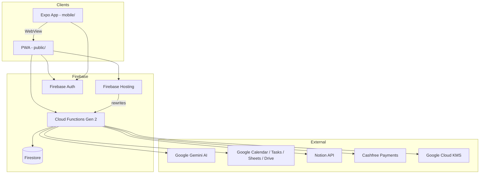

# AI Planner — Project & Tech Stack Report

**AI Planner** is a privacy-focused productivity app that digitizes handwritten planner pages with AI and syncs extracted data to Google Workspace and Notion. It follows a **“Zero Storage”** architecture: images are processed in memory and not persisted on your servers.

**Live:** [planner.analogdigital.tech](https://planner.analogdigital.tech/)  
**Repo:** [github.com/shoubhiksaha/AI-PLANNER](https://github.com/shoubhiksaha/AI-PLANNER)  
**Firebase project:** `ai-planner-project-467800`

---

## 1. High-Level Architecture

The project is a **multi-surface monorepo** with four main stacks:

| Layer | Stack |
|-------|--------|
| Web client | Vanilla JS PWA + Tailwind CSS |
| Mobile client | React Native + Expo (WebView shell) |
| Backend | Firebase Cloud Functions Gen 2 (Node.js 20 on Cloud Run) |
| Data | Firestore (minimal user metadata only) |



---

## 2. Web Frontend Stack (PWA)

### Core technologies
| Technology | Version / Details |
|------------|-------------------|
| **Language** | Vanilla JavaScript (ES modules) — no React/Vue on web |
| **HTML/CSS** | Static HTML + custom CSS + prebuilt Tailwind |
| **Tailwind CSS** | v3.4.19 (build-time, not CDN in production) |
| **PWA** | Service Worker (`sw.js`), Web App Manifest |
| **Module system** | Native browser ES modules (`type="module"`) |

### Key frontend files
- `public/index.html` — main app shell
- `public/app.js` — core application logic (~1,500+ lines)
- `public/app-helpers.js`, `public/streak-utils.js` — helpers
- `public/styles.css`, `public/tailwind.css` — styling
- `public/sw.js`, `public/sw-register.js` — offline/cache strategy

### Firebase client SDK (CDN)
Loaded from `gstatic.com` (not npm):
- **Firebase JS SDK** v11.1.0
  - `firebase-app`
  - `firebase-auth` (Google OAuth, email/password, in-memory persistence for mobile WebView)
  - `firebase-firestore` (lazy-loaded, read-only client access)

### Third-party frontend libraries (CDN)
| Library | Purpose |
|---------|---------|
| **heic2any** (jsDelivr) | Convert HEIC iPhone photos to JPEG |
| **Cashfree JS SDK** v3 | Payment checkout UI |
| **Google Fonts** (Outfit) | Typography |

### PWA features
- `manifest.json` — installable app, standalone display
- Service worker with **network-first** for app shell/scripts, cache busting
- Strict **Content Security Policy** via `firebase.json` headers

### Static pages
| Page | Purpose |
|------|---------|
| `privacy.html` | Privacy policy (Google OAuth compliance) |
| `pricing-policy.html` | Pricing / INR billing |
| `refund-policy.html` | Refund terms |
| `planner.html`, `gear.html` | Additional UI pages |

---

## 3. Mobile Stack (React Native / Expo)

The mobile app is a **native shell around the PWA** — it loads the production web app in a WebView and bridges native Google Sign-In.

### Core technologies
| Technology | Version |
|------------|---------|
| **React** | 19.1.0 |
| **React Native** | 0.81.5 |
| **Expo SDK** | ~54.0.33 |
| **Expo Dev Client** | ~6.0.21 |
| **New Architecture** | Enabled (`newArchEnabled: true`) |

### Key mobile packages
| Package | Purpose |
|---------|---------|
| `react-native-webview` | Embeds `planner.analogdigital.tech` |
| `@react-native-google-signin/google-signin` | Native Google OAuth |
| `expo-secure-store` | Secure token storage |
| `expo-notifications` | Push notifications |
| `expo-camera` | Camera access |
| `expo-haptics` | Haptic feedback |
| `expo-web-browser` | OAuth redirect handling |
| `@react-navigation/*` | Navigation (bottom tabs, native stack) |
| `@react-native-async-storage/async-storage` | Local storage |

### Build & distribution
| Tool | Config |
|------|--------|
| **EAS Build** | `mobile/eas.json` — dev, preview (APK), production (AAB) |
| **iOS bundle ID** | `com.analogdigital.aiplanner` |
| **Android package** | `com.analogdigital.aiplanner` |
| **EAS project ID** | `a317ee97-c4e0-4f1b-ad27-fcc71cd3aa3c` |

### Mobile ↔ Web bridge
- Native app signs in with Google, passes `idToken` + `accessToken` to `window.mobileLogin()` in the WebView
- Push tokens saved via `/updateProfile` backend endpoint
- Theme sync and haptics via `postMessage` bridge

---

## 4. Backend Stack (Firebase Cloud Functions)

### Runtime
| Setting | Value |
|---------|-------|
| **Platform** | Firebase Cloud Functions **Gen 2** (runs on Cloud Run) |
| **Node.js** | 20 |
| **Framework** | `firebase-functions` v7.1.1 |
| **Admin SDK** | `firebase-admin` v13.7.0 |
| **Memory** | 128MiB–1GiB depending on endpoint |
| **Timeout** | Up to 300s for AI/sync workloads |

### HTTP API endpoints (11 functions)

| Endpoint | Purpose |
|----------|---------|
| `POST /syncPlanner` | Main AI extraction + Google/Notion sync |
| `POST /setupNotion` | Encrypt & store Notion integration keys |
| `POST /setupBYOK` | Store Bring Your Own Key (BYOK) AI credentials |
| `POST /updateProfile` | User profile updates (push tokens, etc.) |
| `POST /refreshStaleStreak` | Gamification streak maintenance |
| `POST /exportUserData` | GDPR data export |
| `POST /deleteUserAccount` | Cascading account deletion |
| `POST /logClientError` | Frontend error logging to GCP |
| `POST /createCashfreeOrder` | Payment order creation |
| `POST /cashfreeWebhook` | Payment webhook handler |

All are exposed via **Firebase Hosting rewrites** in `firebase.json`.

### Backend service modules (`functions/services/`)

| Service | Technology | Role |
|---------|------------|------|
| `gemini.js` | `@google/generative-ai` v0.24.1 | Gemini AI extraction with model cascade |
| `UniversalAIAdapter.js` | `node-fetch` v2 | Multi-provider BYOK AI routing |
| `googleSync.js` | `googleapis` v169 | Calendar, Tasks, Sheets sync |
| `notion.js` | `@notionhq/client` v5.6.0 | Notion pages + direct file upload |
| `kms.js` | `@google-cloud/kms` v5.4.0 | Envelope encryption for BYOK keys |
| `cashfree.js` | Native `fetch` | Cashfree payment gateway |
| `rateLimit.js` | Firestore transactions | Per-user rate limiting |

### Secrets & configuration
Managed via Firebase Functions params/secrets:
- `GEMINI_API_KEY`
- `NOTION_ENCRYPTION_KEY`, `NOTION_ENCRYPTION_KEY_V2`
- `CASHFREE_APP_ID`, `CASHFREE_SECRET_KEY`
- `KMS_KEY_NAME`
- Feature flags: `ALLOW_CUSTOM_BYOK_URLS`, `REQUIRE_APP_CHECK`, `PAYMENTS_ENABLED`

---

## 5. AI / ML Stack

### Primary AI: Google Gemini
| Model (cascade order) | Role |
|-----------------------|------|
| `gemini-2.5-flash-lite-preview-06-17` | Primary (fast/cheap) |
| `gemini-2.5-flash-preview-04-17` | Fallback 1 |
| `gemini-2.0-flash-lite` | Fallback 2 (stable) |

**Features:**
- JSON-enforced output (`responseMimeType: application/json`)
- Exponential backoff on HTTP 429
- Automatic model cascade on failure
- Sync-type-specific prompts (morning, evening, journal)

### BYOK (Bring Your Own Key)
`UniversalAIAdapter` supports **14+ AI providers**:

`openai`, `anthropic`, `google`, `azure`, `cohere`, `huggingface`, `groq`, `deepseek`, `mistral`, `perplexity`, `together`, `openrouter`, `ollama`, `local`

BYOK keys are encrypted with **AES-256-GCM** and wrapped via **Google Cloud KMS** envelope encryption.

---

## 6. Database & Security Stack

### Firestore
| Collection | Access | Data stored |
|------------|--------|-------------|
| `users/{email}` | Client read-only; server writes | Profile, tier, credits, encrypted Notion/BYOK keys, streaks |
| `users/{email}/syncHistory` | Client read-only | Sync history metadata |
| `rateLimits` | Server-only | Rate limit counters |

**Security rules:** Client writes are **fully blocked** — all mutations go through Admin SDK in Cloud Functions.

### Encryption
| Layer | Method |
|-------|--------|
| Notion API keys | AES-256-GCM (dual-key rotation support) |
| BYOK API keys | AES-256-GCM + Google Cloud KMS envelope encryption |
| OAuth tokens | In-memory only in browser (not persisted in localStorage) |

### HTTP security headers (Firebase Hosting)
- Content Security Policy (strict, with SHA-256 hashes)
- `X-Frame-Options: DENY`
- `X-Content-Type-Options: nosniff`
- `Referrer-Policy: strict-origin-when-cross-origin`
- `Permissions-Policy` (camera/mic/geo disabled)
- `upgrade-insecure-requests`

### Other security controls
- CORS origin allowlist
- Rate limiting (10 req/min sync, 20 req/min auth endpoints)
- Payload validation (28MB max body, 4MB per image, 20MB total images)
- Optional Firebase App Check enforcement
- BYOK custom URL validation with DNS/IP blocklist (SSRF protection)

---

## 7. Third-Party Integrations

### Google Workspace APIs (`googleapis`)
| API / Scope | Use case |
|-------------|----------|
| **Google Calendar** (`calendar.events`) | Morning schedule → calendar events |
| **Google Tasks** (`tasks`) | To-dos, evening task completion |
| **Google Sheets** (`drive.file`) | Expenses & health metrics logging |
| **Google Drive** (`drive.file`) | Spreadsheet creation/access |

### Notion API
- Brain dump text sync
- Journal image upload via **custom 3-step direct upload protocol** (no self-hosted storage)
- Integration token encrypted at rest

### Authentication
| Provider | Surfaces |
|----------|----------|
| **Firebase Auth** | Web + mobile |
| **Google OAuth 2.0** | Primary sign-in + API scopes |
| **Email/password** | Supported on web (emulator/E2E) |

### Payments: Cashfree
| Component | Details |
|-----------|---------|
| Gateway | Cashfree PG API v2023-08-01 |
| Frontend | Cashfree JS SDK v3 |
| Backend | Order creation + webhook verification |
| Currency | INR (Indian Rupees, GST-inclusive) |
| Tiers | Free, Standard, Pro with credit-based usage |

---

## 8. DevOps, CI/CD & Infrastructure

### Hosting & deployment
| Service | Role |
|---------|------|
| **Firebase Hosting** | Static PWA + API rewrites |
| **Firebase Cloud Functions Gen 2** | Backend API |
| **Firestore** | User metadata |
| **Google Cloud Secret Manager** | Encryption keys |
| **Google Cloud KMS** | BYOK key wrapping |
| **Custom domain** | `planner.analogdigital.tech` |

### GitHub Actions workflows

| Workflow | Trigger | Jobs |
|----------|---------|------|
| `.github/workflows/main.yml` | Push/PR to `main` | Frontend tests, backend tests + coverage, Firestore rules (emulator), Playwright smoke, **auto-deploy to Firebase on main** |
| `.github/workflows/lint.yml` | Push/PR to `main` | ESLint on `functions/` |
| `.github/workflows/playwright-smoke.yml` | Separate smoke workflow |

**CI stack:**
- Node.js 20
- Java 21 (Temurin) for Firestore emulator
- Firebase CLI v13
- GitHub Actions (`checkout@v4`, `setup-node@v4`, `setup-java@v4`)

### Observability (`ops/observability/`)
- GCP log-based metrics for Gemini/Notion failures
- Alert policies: P1 (5xx spike), P2 (AI failures, latency p95 > 60s)
- Setup script: `setup_gcp_alerts.sh`

### Production SLOs
| Metric | Target |
|--------|--------|
| Availability | 99.9% |
| Latency (p95) | < 30s |
| Error budget | 0.1%/month |

---

## 9. Testing Stack

### Test frameworks
| Layer | Tool | Location |
|-------|------|----------|
| **Backend unit/integration** | Jest 30 | `functions/__tests__/` (12 test files) |
| **Frontend unit** | Jest 30 + jsdom | `public/__tests__/` |
| **Firestore rules** | `@firebase/rules-unit-testing` + emulator | `firestore.rules.test.js` |
| **E2E** | Playwright 1.58 | `e2e/tests/` |
| **Mobile lint** | ESLint 10 | `mobile/` |
| **Backend lint** | ESLint 8 + `eslint-plugin-node` | `functions/` |

### Coverage thresholds (backend)
- Statements/lines: 70%+
- Functions: 70%+
- Branches: 60%+

### npm test scripts (root `package.json`)
```bash
npm run test:backend      # Jest in functions/
npm run test:frontend     # Jest + jsdom in public/
npm run test:rules        # Firestore emulator rules tests
npm run test:e2e:smoke    # Playwright headless smoke
npm run test:mobile       # ESLint on mobile/
npm run quality:ci        # Full CI gate locally
```

---

## 10. Styling & Build Tooling

| Tool | Purpose |
|------|---------|
| **Tailwind CSS** v3.4 | Utility-first CSS (build: `src/input.css` → `public/tailwind.css`) |
| **tailwind.config.js** | Scans `public/**/*.html`, dark mode via `.dark-mode` class |
| **Python 3 http.server** | Local dev + E2E test server |

---

## 11. Product Features & Business Logic

### Sync workflows
| Mode | What it does |
|------|--------------|
| **Morning** | Schedule → Calendar events + Google Tasks |
| **Evening** | Task completion, expenses/health → Sheets, brain dump + image → Notion |
| **Journal** | Image upload to Notion + AI date extraction |

### Subscription tiers
| Tier | Limits (approx.) |
|------|------------------|
| **Free** | 1 page/sync |
| **Standard** | Multi-page journal (up to 3), 1 page morning/evening |
| **Pro** | Up to 5 pages/sync |

### Gamification
- Daily sync streaks (morning/evening/journal)
- Milestone rewards: 7-day, 30-day, 90-day
- Streak freezes, booster credits, monthly credit renewal

### Compliance
- GDPR data export (`/exportUserData`)
- Account deletion (`/deleteUserAccount`)
- Google API Services User Data Policy alignment
- OAuth verification documentation in `docs/oauth-verification/`

---

## 12. Repository Structure

```
AI_PLANNER/
├── public/              # PWA frontend (hosted)
├── functions/           # Cloud Functions backend
│   ├── services/        # AI, Google, Notion, KMS, Cashfree, rate limit
│   ├── __tests__/       # Backend tests
│   └── scripts/         # Security migration scripts
├── mobile/              # Expo/React Native app
├── e2e/                 # Playwright E2E tests
├── src/                 # Tailwind source CSS
├── ops/observability/   # GCP alerting setup
├── docs/                # OAuth verification, security, privacy history
├── .github/workflows/   # CI/CD pipelines
├── firebase.json        # Hosting, functions, emulators, CSP
├── firestore.rules      # Security rules
└── WIKI.md              # Architecture single source of truth
```

---

## 13. Complete Dependency Summary

### Root (`package.json`)
- `@notionhq/client`, `google-auth-library`, `googleapis`, `dotenv`
- Dev: `jest`, `jest-environment-jsdom`, `tailwindcss`

### Functions (`functions/package.json`)
- `@google-cloud/kms`, `@google/generative-ai`, `@notionhq/client`, `firebase-functions`, `googleapis`, `node-fetch`
- Dev: `eslint`, `firebase-admin`, `firebase-functions-test`, `jest`, `@firebase/rules-unit-testing`

### Mobile (`mobile/package.json`)
- Expo 54 ecosystem, React 19, React Native 0.81, React Navigation 7, Google Sign-In

### E2E (`e2e/package.json`)
- `@playwright/test`, `@types/node`

---

## 14. Version History (Product Evolution)

The project has evolved through **V1–V9** (documented in README/WIKI):

| Version | Highlights |
|---------|------------|
| V1 | MVP — image → Calendar |
| V2 | Evening sync, expenses, health, journaling |
| V3 | Zero Storage, Gemini cascade, Notion upload |
| V4 | CSP hardening, auth improvements, Firestore lockdown |
| V5 | Rate limiting, payload validation, key rotation |
| V6 | Custom domain CORS, sync reliability fixes |
| V7 | Test expansion (261+ backend tests), gamification, GDPR |
| V8 | Google OAuth verification readiness |
| V9 | BYOK + Cloud KMS (current) |
| V10 (roadmap) | Agentic AI, multi-provider fallback, CSP reporting |

---

## 15. Summary: Full Tech Stack at a Glance

| Category | Technologies |
|----------|-------------|
| **Languages** | JavaScript (ES modules), HTML, CSS |
| **Web** | Vanilla JS PWA, Tailwind CSS 3, Service Workers |
| **Mobile** | React Native 0.81, React 19, Expo 54, WebView shell |
| **Backend** | Node.js 20, Firebase Functions Gen 2, Cloud Run |
| **Database** | Firestore |
| **Auth** | Firebase Auth, Google OAuth 2.0 |
| **AI** | Google Gemini (cascade), UniversalAIAdapter (14+ BYOK providers) |
| **Integrations** | Google Calendar/Tasks/Sheets/Drive, Notion API |
| **Payments** | Cashfree (INR) |
| **Security** | AES-256-GCM, Google Cloud KMS, Secret Manager, CSP, App Check |
| **Testing** | Jest, Playwright, Firestore Rules Unit Testing |
| **CI/CD** | GitHub Actions, Firebase CLI, EAS Build |
| **Cloud** | Google Cloud Platform (Firebase, KMS, Logging, Monitoring) |
| **Observability** | GCP log metrics, alert policies, Slack/email notifications |

---

This is a **production-grade, privacy-first full-stack application** with a deliberately minimal frontend (no heavy web framework), a serverless GCP backend, native mobile wrapper, multi-AI support, and strong security/testing practices. If you want, I can go deeper on any one area — for example the BYOK/KMS flow, payment integration, or the mobile WebView bridge.
